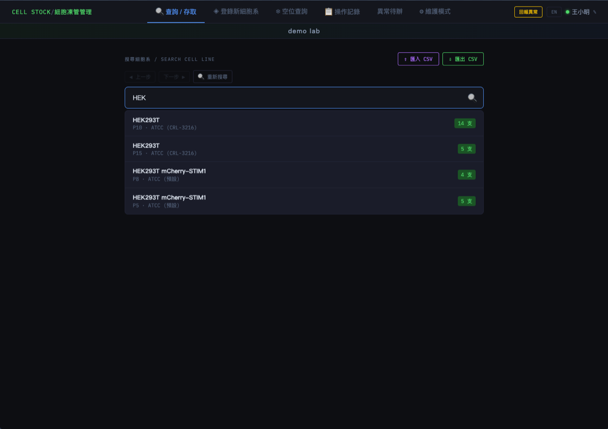
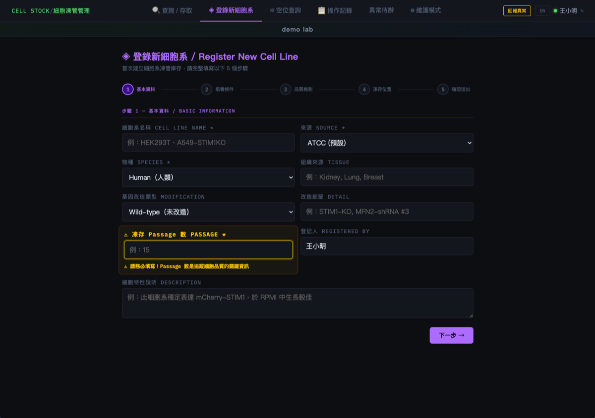
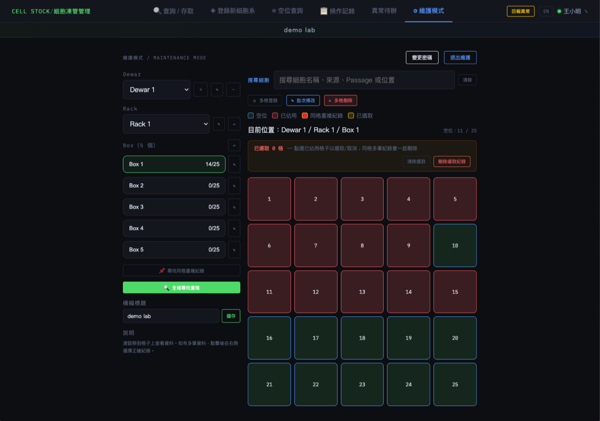

# Cell Stock Manager

*[中文版說明請見 README.zh.md](README.zh.md)*

A lab cell-vial inventory management system that replaces error-prone Excel spreadsheets, keeping a complete, traceable record of every vial that goes in or out of the freezer.

## Why this project exists

Common problems with managing cell vial inventory in Excel:

- No access log — no way to trace who took out or returned which vial, and when
- The spreadsheet often drifts out of sync with what's actually in the freezer, leading to "the sheet says it's still there, but the slot is empty"
- Multiple people sharing one spreadsheet leads to overwritten edits and hard-to-avoid version conflicts
- Finding an empty slot or a specific cell line means manually scanning through everything — slow and error-prone

Cell Stock Manager replaces Excel with a lightweight, self-hostable web app. Every registration, take-out, and return is written to a database with a full activity log, keeping your inventory data consistent with what's actually in the lab.

## Features

- **Search / Access**: search existing cell lines and log take-out / return
- **Register New Cell Line**: create new cell line and vial records
- **Box Availability**: quickly find open slots in the freezer
- **Activity Log**: complete access/change history, traceable to operator and time
- **Issue Queue**: flag and track data discrepancies (e.g. records that don't match reality) for follow-up
- **Maintenance Mode**: admin-only features for data maintenance and system configuration

## Screenshots

<table>
<tr>
<td><br>First use: enter operator name</td>
<td><br>Search / Access</td>
</tr>
<tr>
<td><br>Register New Cell Line</td>
<td><br>Maintenance Mode: visual Dewar / Rack / Box management</td>
</tr>
</table>

## Tech stack

- Frontend: plain HTML / CSS / JavaScript (no framework)
- Backend: PHP + SQLite
- Deployment: Docker (Docker-only; this project does not provide a manual install path)

## Quick start

This project is deployed via Docker only — the database, permissions, and PHP extensions are all handled inside the container, so you don't need to set up a web server or PHP environment yourself.

### Option 1: Synology NAS (recommended — no programming background needed)

See [`SYNOLOGY_DOCKER_INSTALL.md`](SYNOLOGY_DOCKER_INSTALL.md) — the whole process uses DSM's **Container Manager** graphical interface, no command line required.

### Option 2: Other platforms (basic command-line experience)

1. Copy `.env.example` to `.env` and fill in the port, admin credentials, and lab name.
2. From the project root, run:

```bash
docker compose up -d --build
```

3. Open `http://<host-IP>:<CELLSTOCK_HTTP_PORT>/cell-stock-manager.html`

The database and backups are stored in two Docker named volumes, `cellstock-data` and `cellstock-backups`, so rebuilding the image won't lose your data.

## Data & backups

System data is stored in a SQLite database, with an automatic backup mechanism (see the backup section in [`SYNOLOGY_DOCKER_INSTALL.md`](SYNOLOGY_DOCKER_INSTALL.md)). Before relying on this in production, confirm the backup process meets your lab's data retention needs.

## License

This project is licensed under the [MIT License](LICENSE).

Copyright (c) 2026 YuChiao Lin

## Author

YuChiao Lin
